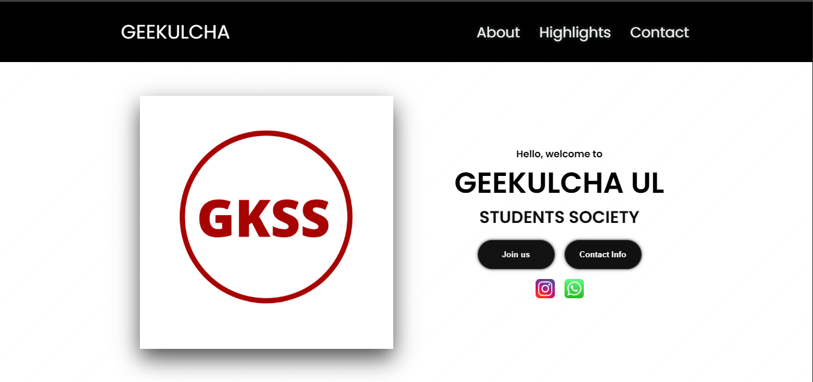

# Geekulcha Dash

**A simple dashboard for Geekulcha students** 🎓
## 📸 Preview

Welcome to **Geekulcha Dash** — a lightweight and interactive dashboard built for students in the Geekulcha community to view relevant info through a clean UI. This project is ideal for hackathons, student showcases, or portfolio demos!

---

## 🚀 Features

- 🔹 Responsive dashboard UI written with **HTML, CSS & JavaScript**
- 🔹 Easy to customize for your own data or Geekulcha programs
- 🔹 Lightweight and beginner-friendly
- 🔹 Perfect starting point for adding backend or API integrations

---

## 📁 Project Structure

